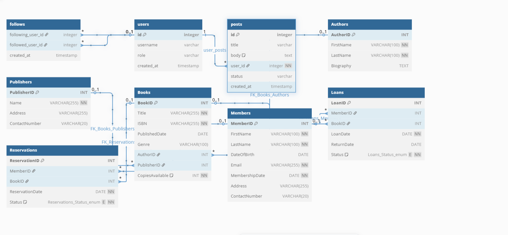

# Library Management System

## 📚 Project Overview

The **Library Management System** is a relational database project designed to manage books, authors, publishers, members, loans, and reservations in a library. It provides structured data storage with constraints, relationships, and efficient querying capabilities using SQL.

## 🧩 Features

- Manage records of:
  - Authors
  - Publishers
  - Books
  - Library Members
  - Book Loans
  - Book Reservations
- Enforce foreign key relationships and data integrity
- Status tracking via ENUMs for loans and reservations

## 🛠️ Setup Instructions

To run or import this project locally:

1. Open your preferred MySQL database client (e.g., MySQL Workbench, phpMyAdmin).
2. Copy and run the provided SQL script (`library_management.sql`) in your SQL query editor.
3. The script will:
   - Create the `LibraryManagementSystem` database
   - Create and populate all six main tables
   - Define necessary relationships via foreign keys

## 🖼️ Entity Relationship Diagram (ERD)

The image below represents the ERD of the system, showing all entities and their relationships:
